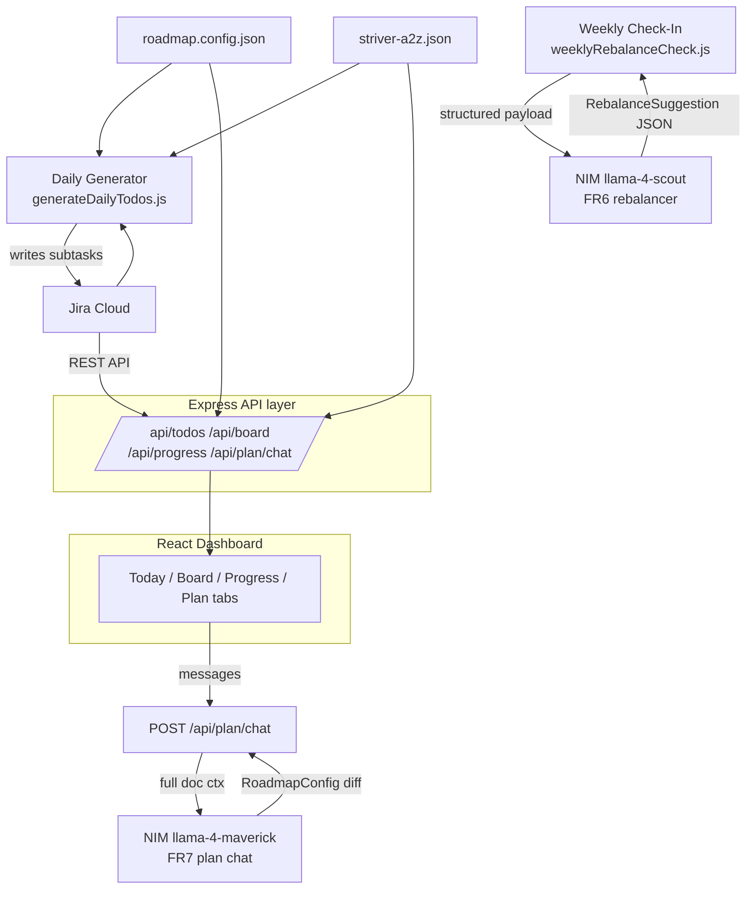

# PrepPilot

A daily todo generator for a 12-month placement prep plan. Reads a quarterly
roadmap config and a Striver A2Z DSA sheet, checks actual progress against
plan via Jira, and generates each day's specific tasks — synced to Jira,
displayed on a dashboard.

Full design decisions and requirements: [`SPEC.md`](./SPEC.md)

## Status

- [x] Phase 0 — Jira project scaffolding script
- [x] Phase 1 — Striver A2Z sheet as structured data
- [x] Phase 2 — Daily todo generator (logic + Jira sync)
- [x] Phase 3 — Dashboard (today's todos + board + progress views)
- [ ] Phase 4a — Fix NIM rebalancing agent (swap to `llama-4-scout`, refactor prompt + model selection)
- [ ] Phase 4b — Conversational Plan Builder chat tab (`POST /api/plan/chat` + `PlanView.jsx`)
- [ ] Phase 4c — Rebalance suggestion card on dashboard (approve/reject UI)
- [ ] Phase 4d — All-track progress view + streak counter
- [ ] Phase 5 — SQLite history, UI polish, GitHub Actions CI, deploy to Vercel + Render

## Quickstart

### Backend

```bash
cd backend
cp .env.example .env    # fill in Jira credentials + NIM_API_KEY
npm install
npm run setup:jira      # Phase 0: creates quarter epics + track stories
npm run generate:today  # Phase 2: generates and pushes today's todos
npm run dev              # Phase 3: starts the API on http://localhost:4000
npm test                 # run the logic tests
```

### Frontend

```bash
cd frontend
cp .env.example .env    # defaults to http://localhost:4000/api, adjust if needed
npm install
npm run dev              # starts the dashboard on http://localhost:5173
```

Run the backend first — the dashboard has nothing to read otherwise.

### Prerequisites

1. A Jira Cloud site with an empty project created (Kanban or Scrum), key
   matching `JIRA_PROJECT_KEY` in `.env`.
2. A Jira API token: https://id.atlassian.com/manage-profile/security/api-tokens
3. An NVIDIA NIM API key (free): https://build.nvidia.com — needed for Phase 4
4. Node.js 18+

## Tech Stack

| Layer | Choice | Notes |
|---|---|---|
| Backend | Node.js + Express | ESM, Node 18+ |
| Frontend | React + Vite | Tabs: Today / Board / Progress / Plan |
| Jira | REST API v3 | Backend only — token never reaches browser |
| LLM — FR6 | NIM `nvidia/nemotron-3.5-lightning-30b-a3b` | Fastest agentic 30B MoE, confirmed free endpoint. Fallback: `deepseek-ai/deepseek-v4.1-flash`. |
| LLM — FR7 | NIM `nvidia/nemotron-3-ultra-550b-a55b` | 1M context, planning-specialized. Fallback: `nvidia/nemotron-3-super-120b-a12b`. |
| Data store | SQLite (`better-sqlite3`) | Phase 5: `WeeklyCheckIn` + `RebalanceSuggestion` history |
| Frontend host | Vercel Hobby (free) | Static, no sleep/cold-start |
| Backend host | Render free tier | 750 hrs/month; UptimeRobot ping to prevent sleep |
| CI/CD | GitHub Actions | Daily todo cron + weekly rebalance cron |

## Architecture

See [`SPEC.md`](./SPEC.md#5-architecture-as-built) for the full narrative.




### Backend API

A thin Express layer on top of the existing Jira client and Striver data,
purely for the dashboard to consume.

| Endpoint | Method | Returns |
|---|---|---|
| `/api/health` | GET | Liveness check |
| `/api/todos/today` | GET | Today's Jira subtasks, with track + status |
| `/api/todos/:key/transition` | POST | Move a subtask to a new status |
| `/api/board` | GET | Subtasks grouped into To Do / In Progress / Done |
| `/api/progress` | GET | DSA completion + per-step breakdown |
| `/api/plan/chat` | POST | FR7: multi-turn plan chat, returns assistant reply |
| `/api/rebalance/latest` | GET | Most recent `RebalanceSuggestion` (Phase 4c) |
| `/api/rebalance/approve` | POST | Approve a suggestion → writes to `roadmap.config.json` (Phase 4c) |

The frontend never talks to Jira directly — it only calls this API.

### Frontend Dashboard

A Vite + React app (`/frontend`) with four views, tabbed:

- **Today** — today's generated subtasks, track/status badges, done-button, 30s auto-refresh,
  server-side auto-transition to "In Progress" on first load each day.
  Also shows the latest rebalancing suggestion card (approve/reject) when one is pending.
- **Board** — 3-column kanban (To Do / In Progress / Done) with HTML5 drag-and-drop.
  Optimistic UI: card moves instantly, Jira update in background, rolls back on failure.
- **Progress** — DSA completion % + per-step bars across all 18 Striver A2Z steps.
  All-track hours view (Phase 4d) and streak counter pending.
- **Plan** — (Phase 4b) conversational chat for creating/revising the roadmap.
  Propose a brain-dump or paste an existing plan; bot produces a `RoadmapConfig` diff
  you approve before it writes to `roadmap.config.json`.

Configured via `VITE_API_URL` in `frontend/.env` so it can point at a
deployed backend later without code changes.

## Extending the Striver sheet

`backend/src/data/striver-a2z.json` is fully scraped — all 18 steps, 474
problems, sourced from the Next.js flight payload on
[takeuforward.org](https://takeuforward.org/strivers-a2z-dsa-course-sheet-2/)
rather than DOM scraping, so it stays accurate if the site's markup changes.
Re-run `npm run scrape:striver` in `backend/` if the source sheet is updated
upstream.

## Deploy

### Frontend — Vercel

```bash
cd frontend
npm run build
npx vercel --prod
# Set VITE_API_URL to your Render backend URL in Vercel project settings
```

### Backend — Render

1. Connect your GitHub repo on [render.com](https://render.com).
2. New Web Service → root dir `backend`, build `npm install`, start `npm start`.
3. Set env vars: `JIRA_BASE_URL`, `JIRA_EMAIL`, `JIRA_API_TOKEN`, `JIRA_PROJECT_KEY`, `NIM_API_KEY`, `NIM_MODEL=nvidia/nemotron-3.5-lightning-30b-a3b`, `NIM_MODEL_FR7=nvidia/nemotron-3-ultra-550b-a55b`, `PORT=4000`.
4. Add [UptimeRobot](https://uptimerobot.com) monitor on `https://<render-url>/api/health` every 5 min to prevent free-tier sleep.

## Roadmap

- [x] Mark problems/todos done directly from the dashboard
- [x] Auto-refresh polling (30s) on Today and Board
- [x] Today's tasks auto-transition to "In Progress" on first view each day
- [ ] **Phase 4a** — Fix NIM rebalancing: swap to `llama-4-scout`, refactor env mutation, fix system prompt
- [ ] **Phase 4b** — Conversational Plan Builder: `POST /api/plan/chat` + `PlanView.jsx`
- [ ] **Phase 4c** — Rebalance suggestion card on Today view (approve/reject)
- [ ] **Phase 4d** — All-track progress view + streak counter
- [ ] **Phase 5** — SQLite history, UI polish (Inter font, glassmorphism, animations), GitHub Actions crons, deploy

Screenshots intentionally deferred — dashboard still actively changing. Add once Phase 5 stabilizes the UI.
